# SSE Study

---

## 📖 프로젝트 소개

이 프로젝트는 Server-Sent Events(SSE)를 활용한 이벤트 처리 및 알림 기능을 테스트하고, 그 결과를 기록하기 위한 스터디 프로젝트입니다.

SSE를 선택한 이유는, 이전에 진행한 끄적끄적 프로젝트에서 알림 기능을 구현하며 SSE를 경험했기 때문입니다. 이번 프로젝트에서는 SSE를 더욱 깊이 이해하고, 다양한 상황에서의 적용 결과를 확인하고자 합니다.

구현 과정에서 발생하는 이슈와 해결 방법, 그리고 학습 내용을 문서화하여 기록으로 남길 예정입니다.

<br>

## 🛠 기술 스택

|      🖥️ Frontend      |        💯 Backend        |
| :-------------------: | :----------------------: |
|         React         |       Spring boot        |
|      Typescript       |           Java           |
| event-source-polyfill | Server-Sent Events (SSE) |
|           -           |          MySQL           |
|           -           |          Redis           |
|           -           |          Kafka           |
|           -           |        Zookeeper         |
|           -           |  Docker, Docker Compose  |

<br>

## ⭐️ 목표

- 서버와 클라이언트 간 실시간 이벤트 처리 구조에 대해 심층적으로 학습하고, 이를 다양한 상황에서 분석 및 응용합니다.
- 다양한 환경에서 SSE를 활용한 알림 기능의 성능 및 동작 테스트를 진행합니다.

<br>

## 💡 고민할 점

- SSE는 서버 메모리에 데이터를 유지하는 특성이 있습니다. 만약 서버가 종료되었다가 다시 시작되면, 기존 연결 상태 및 데이터를 어떻게 복구하거나 처리할 수 있을까?
- 서버가 여러 대로 분산된 환경에서 SSE 연결을 어떻게 효율적으로 관리할까? 클라이언트 요청을 적절히 분배하고, 서버 간 상태 동기화를 유지하려면 어떤 전략이 필요할까?

<br>

---

## 🧑🏻‍💻 기록

1. [SSE 연결 프론트엔드, 백엔드 세팅](#1-sse-연결-프론트엔드-백엔드-세팅)
2. [SSE 연결 상태 캐시 도입](#2-sse-연결-상태-캐시-도입)
3. [메시지 브로커 Kafka 도입](#3-메시지-브로커-kafka-도입)
4. [배포 환경 세팅](#4-배포-환경-세팅)
5. [프로젝트 테스트](#5-프로젝트-테스트)

### [1. SSE 연결 프론트엔드, 백엔드 세팅]

[연결된 이슈](https://github.com/giwoong01/sse-study/issues/1)

SSE는 한 번 연결하면 계속 연결 상태를 유지합니다.
서버가 바뀌면서 메모리가 초기화되거나, 에러로 인해 연결이 끊기지 않는 이상 연결 상태는 유지됩니다.
그렇다면 이 연결 상태는 어떻게 관리할까요? 프론트는 연결 상태를 인지하기 어렵습니다. 서버에서 일방적으로 이벤트를 받을 뿐입니다.

제 생각에는 SSE 연결 상태는 서버에서 관리가 되어야 할 것 같습니다. 그 이유는 고민할 점에서 이야기한 부분과도 관련이 있습니다.
서버가 종료되었다가 다시 시작되면 메모리가 초기화되는데, 이는 레디스와 같은 캐시 스토리지로 연결 상태를 관리하면 좋을 것 같습니다.

프론트엔드에서 SSE 로직을 구현할 때 고민이 많았습니다. 커스텀 훅을 만들지, 함수형으로 만들지. 이 두가지 방법에는 각 장단점이 존재합니다.
커스텀 훅은 로직이 복잡하지만 재사용성과 가독성, 확장성면에서 좋습니다. 함수형은 로직이 간단하지만 확장이 어렵습니다.
그래서 저는 재사용성과 확장성을 고려해 커스텀훅을 선택했습니다.

커스텀 훅을 사용했을 때 특정 페이지에서는 커스텀 훅을 사용하고 싶지 않은 경우가 있어, 전체적으로 커스텀 훅을 사용하도록 강제하지 않아야합니다.

이 경우 3가지 방법이 존재합니다.

1. 조건적으로 커스텀 훅을 호출합니다.
2. 커스텀 훅으로 분리하되 각 페이지에서 필요할 때만 사용합니다.
3. SSE를 글로벌하게 처리해 필요한 컴포넌트만 구독합니다.

처음에는 2번과 같이 각 페이지에서 필요할 때만 커스텀 훅을 사용하려했습니다.
하지만 페이지를 이동할 때마다 해당 컴포넌트가 언마운트되므로 SSE 연결이 닫히고, 새 페이지에서 다시 SSE 연결이 이루어지는 구조가 됩니다.
즉, 매번 SSE 연결을 다시 생성했다가, 페이지 이동 시 언마운트되어 연결이 닫히는 일이 반복됩니다.

커스텀 훅을 사용한 방식은 페이지를 자주 이동하거나 SSE 연결 시간이 중요한 경우에는 비효율적일 수 있습니다.
특히 서버에서는 매번 새로운 SSE 클라이언트를 처리해야하므로 부하가 가증됩니다.

그렇기에 저는 Context API를 활용하려고 합니다. SSEProvider를 구현하여 특정 페이지를 제외하고 감싸줍니다.

```javascript
const App = () => {
  return (
    <BrowserRouter>
      <Routes>
        <Route path="/" element={<LoginPage />}></Route>
        <Route path="/register" element={<RegisterPage />}></Route>

        <Route
          path="/*"
          element={
            <SSEProvider>
              <Routes>
                <Route path="/home" element={<Home />} />
                <Route path="/dashboard" element={<Dashboard />} />
              </Routes>
            </SSEProvider>
          }
        ></Route>
      </Routes>
    </BrowserRouter>
  );
};
```

이로써 "/"를 제외한 모든 페이지에서 SSE를 관리하게됩니다.

```javascript
const { data } = useSSE();
```

그리고 특정 페이지에서 SSE를 구독하는 방법은 이와 같습니다.

Context API를 활용하여 SSE 관리를 함으로써 SSE연결은 전역적으로 유지가 되고,
필요한 컴포넌트에서만 SSE 구독이 가능합니다.

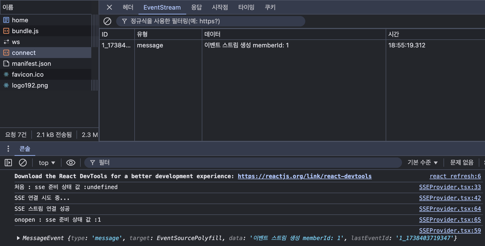
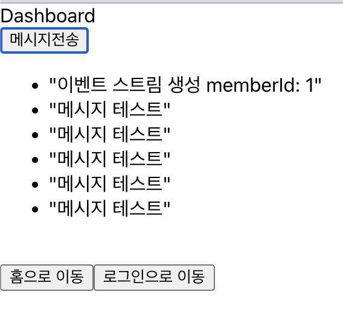

<br>

이와 같이 프론트엔드의 세팅을 어느정도 마무리하였습니다.
이미 백엔드에서 SSE 연동 로직을 구현을 해두었기때문에,
추가적으로 필요한 부분은 서버와 연동하면서 수정할 예정입니다.

---

### [2. SSE 연결 상태 캐시 도입]

[연결된 이슈](https://github.com/giwoong01/sse-study/issues/2)

SSE 연결을 어떻게 관리해야 할까요?

서버가 한 대뿐이라면 단순히 메모리에 저장해도 문제가 없겠지만,

- 서버가 여러 대인 경우 사용자가 A 서버에 SSE 연결된 상태여도 B 서버에서는 해당 연결 정보를 알 수 없음.
- 무중단 배포(블루-그린 배포) 등의 상황에서 서버가 재시작되면 기존의 SSE 연결 정보가 사라짐.

이 문제를 해결하기 위해 Redis를 캐시 저장소로 활용하여 SSE 연결 상태를 관리하려 합니다.

SSE 연결 상태 저장을 위해 Hash 구조를 선택합니다.

Hash 구조는 여러 필드를 하나의 키 아래에 저장할 수 있어, sse_connections라는 하나의 키 아래에 여러 emitterId와 serverId 쌍을 저장할 수 있습니다.
이와 같은 구조를 사용함으로써 관리가 용이하고, 특정 emitterId에 대한 serverId를 빠르게 조회할 수 있습니다.

Redis Hash를 사용하여 이와 같은 형태로 SSE 연결 정보를 저장합니다.

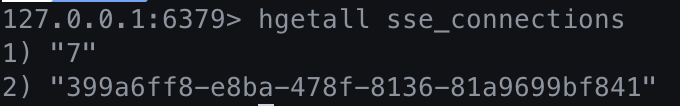

```
Key: sse_connections
Field (Key): emitterId  ("7")
Value: SERVER_ID        ("399a6ff8-e8ba-478f-8136-81a9699bf841")
```

이를 통해 특정 사용자의 SSE 연결이 어느 서버에 있는지 쉽게 조회할 수 있습니다.

하지만 연결 상태만 캐시 스토리지에 저장한다고 해서 멀티 서버에서의 알림 누락 문제는 해결되지 않습니다.
예를 들어, 사용자가 A 서버에 연결했지만 B 서버에서 알림을 보낸다면 A 서버는 이를 감지할 수 없습니다.

이를 해결하기 위해 메시지 브로커 Kafka를 도입하여 멀티 서버 환경에서도 문제 없이 알림이 가도록 해결해보도록 하겠습니다.

---

### [3. 메시지 브로커 Kafka 도입]

[연결된 이슈](https://github.com/giwoong01/sse-study/issues/3)

메시지 브로커인 Kafka를 도입하여 멀티 서버인 경우 테스트를 진행해보도록 하겠습니다.

Kafka는 분산 환경에서 안정적인 데이터 스트리밍을 지원하는 메시지 브로커입니다.
이를 활용하면 멀티 서버 환경에서도 효율적인 이벤트 전파와 메시지 처리가 가능합니다.

Kafka는 일반적으로 여러 서버에서 운영되지만, 이번 테스트에서는 단일 서버 환경에서 포트를 나누어 동작을 검증하겠습니다.

|               `동작과정`               |
| :------------------------------------: |
| 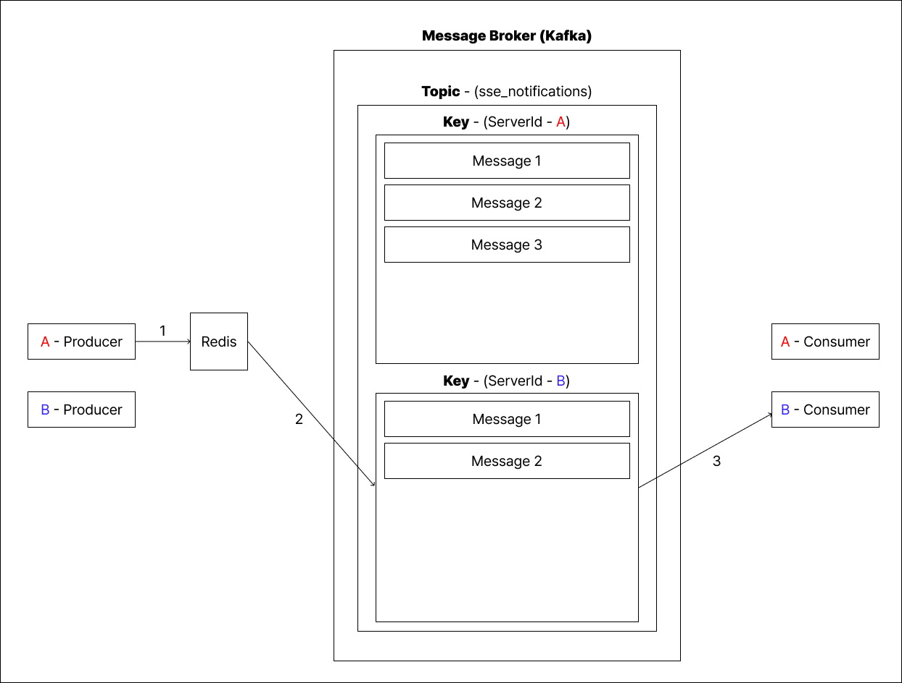 |

1. Producer(A 서버)는 Redis에서 알림을 보낼 사용자의 serverId(B 서버)를 조회합니다.
2. Kafka Topic에 serverId를 Key로 설정하여 메시지를 전송합니다.
   - Topic 내부에서 serverId 별로 메시지를 분배합니다.
   - 같은 serverId를 가진 메시지는 동일한 서버에서 처리합니다.
3. Consumer(B 서버)는 B 서버로 전달된 메시지를 수신합니다.
   - 수신된 메시지는 SseEmitter를 통해 클라이언트에게 전달됩니다.

위 과정을 통해 Kafka를 활용한 메시지 전송이 어떻게 이루어지는지 확인할 수 있습니다.  
이제 배포된 환경에서 직접 테스트를 진행해 보겠습니다.

추가적으로 Kafka 설정 시, @KafkaListener와 설정 파일을 통해 Consumer Group(groupId)을 설정할 수 있습니다.
groupId는 Kafka Consumer Group을 식별하는 ID로, 메시지의 소비 방식에 영향을 줍니다.

저는 serverId를 Key로 사용하여 메시지를 각 서버에 정확히 전달하여 상대방에게 보내는게 목적이므로 동일한 groupId를 사용해도 무방하다고 생각합니다.

그러면 Consumer Group(groupId)은 어떤 상황에서 잘 사용할 수 있을까요?

일단 제가 사용한 방법인 실시간 알림 상황에서는 동일한 groupId를 사용하여 메시지의 중복 소비를 방지합니다. 그 외 상황으로는 전체 공지나, 로그를 백업하거나 분석하는 부분에서는 서버마다 다른 groupId를 활용합니다.

- 전체 공지 같은 작업은 서로 다른 groupId를 통해 같은 메시지를 여러 Consumer에게 전달할 수 있습니다.
  - 같은 Consumer Group에 있으면 동일한 Partition 내에서 하나의 Consumer에게만 메시지를 할당하기 때문입니다.
    - 메시지를 모두에게 보내고 싶어도 하나의 서버만 메시지를 처리합니다.
- 로그를 백업하거나 분석하는 부분에서는 별도의 Consumer Group으로 독립적으로 처리합니다.
  - 로그백(디스코드, 슬랙)을 위한 groupId 별도 부여

예를 들면 이와 같습니다.

| 서버 이름 | 실시간 알림 Topic | 실시간 알림 groupId | 전체 공지 Topic | 전체 공지 groupId |
| :-------: | :---------------: | :-----------------: | :-------------: | :---------------: |
| Server A  | sse_notifications |      sse-group      |    broadcast    |   serverA-group   |
| Server B  | sse_notifications |      sse-group      |    broadcast    |   serverB-group   |
| Server C  | sse_notifications |      sse-group      |    broadcast    |   serverC-group   |

여러 상황에서 groupId를 잘 활용한다면 다양한 처리를 쉽게 설계할 수 있을 것 같습니다.

다음 과정에서는 Kafka 브로커가 잘 작동하는지 배포된 환경에서 멀티 포트 서버를 두고 테스트 해보겠습니다.

---

### [4. 배포 환경 세팅]

[연결된 이슈](https://github.com/giwoong01/sse-study/issues/4)

Kafka 브로커가 잘 작동하는지 확인하기 전에 서버를 먼저 세팅하도록 하겠습니다.

서버는 오라클 클라우드를 사용하여 배포합니다.
운영체제는 우분투 기반으로 무료 인스턴스를 사용합니다.

서버 내부에 MySQL, Java, Nginx, CertBot, Docker, Docker Compose를 설치합니다.

Spring Boot App과 Redis, Kafka, Zookeeper 는 Docker Compose를 활용하여 실행해주겠습니다.

Docker Compose를 사용한 이유는 Redis, Kafka, Zookeeper, Spring Boot App 등 여러 서비스를 단일 파일로 쉽게 정의할 수 있기 때문입니다. 그리고 또 서비스 간 의존성과 연결을 자동화하여 복잡한 설정을 제거하고, 컨테이너의 재구성, 확장이 매우 쉽기 때문입니다.

추가적으로 이 과정을 수작업으로 환경을 구성할 경우 복잡성이 크게 증가합니다. Docker Compose를 사용함으로써 효율적으로 환경을 구성할 수 있습니다.

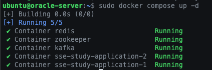

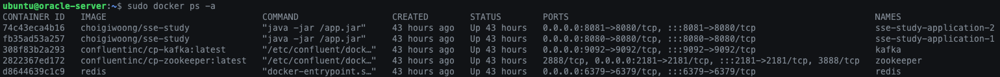

Spring Boot App은 포트를 달리하여 2개를 열어주겠습니다.

NGINX를 활용하여 포트 기반 로드 밸런싱 테스트를 진행하기 위함입니다.

- 포트 기반 로드 밸런싱

  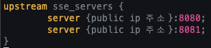
  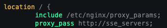

  라운드 로빈 방식으로 로드 밸런싱을 구현합니다.

- SSE 연결 설정 Location 블록

  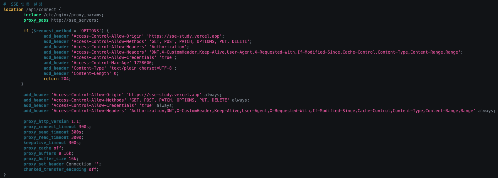

  SSE 연결은 클라이언트-서버 간 지속적인 연결을 필요로 하기 때문에, CORS 요청과 프리플라이트 OPTIONS 요청 처리가 중요합니다.
  그리고 Timeout과 cache 설정을 통해 안정적이고 실시간적인 SSE 연결을 유지하도록 합니다.

NGINX 설정까지 마치면 서버 세팅은 끝이 났습니다.

|                    `다이어그램`                     |
| :-------------------------------------------------: |
| 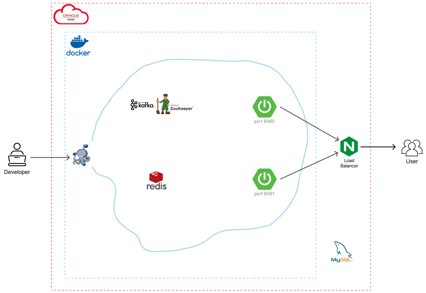 |

<br>

마지막으로 Vercel을 사용하여 프론트 엔드 배포를 하면 세팅은 끝입니다.

[서비스 링크](https://sse-study.vercel.app/)

---

### [5. 프로젝트 테스트]

[연결된 이슈](https://github.com/giwoong01/sse-study/issues/5)

가장 먼저 확인할 부분은 캐시 스토리지에 사용자 마다 serverId가 잘 저장되는지입니다.

현재 서버는 포트가 8080, 8081로 2개 열려있고, Nginx 설정으로 인해 라운드 로빈 형식으로 로드 밸런싱이 구현되어있습니다.

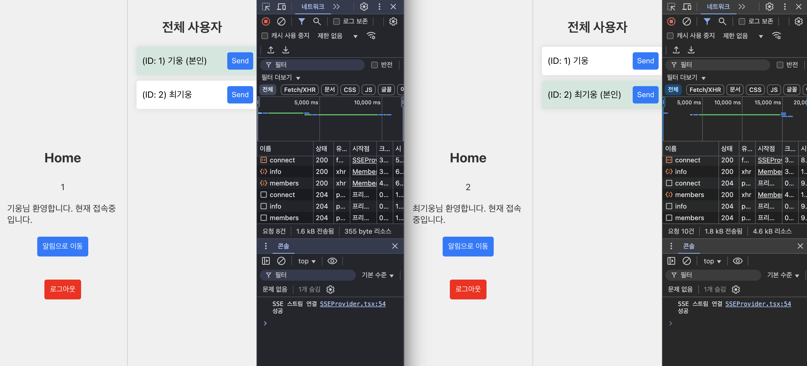

사용자가 SSE 연결을 완료하면 캐시 스토리지에 emitterId와 serverId가 저장됩니다.

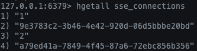

- 1번 사용자 - A 서버 ID
- 2번 사용자 - B 서버 ID

이것으로 SSE 연결시 각 서버로 연결된 것을 확인할 수 있습니다.

캐시 데이터에 저장된 serverId를 이용해서 메시지 브로커로 다른 서버로 메시지가 잘 전달 되는지 확인해보겠습니다.

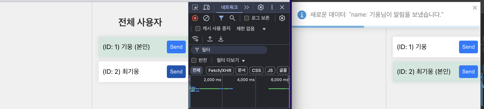

- 1번 사용자(기웅)가 2번 사용자(최기웅)에게 알림을 보냅니다.
  - send 버튼을 눌러 알림을 보낼 수 있습니다.
  - 두 사용자는 위의 캐시 데이터 사진과 같이 각각 다른 서버에 SSE 연결이 되어있음을 알 수 있습니다.
- 2번 사용자(최기웅)는 1번 사용자(기웅)에게 알림을 받습니다.
  - 사진과 같이 Toast로 알림이 온 것을 확인할 수 있습니다.
  - 알림이 보내지는 것으로 보아 메시지 브로커가 의도대로 잘 작동한 것을 알 수 있습니다.

해당 상황의 동작 과정은 <[3. 메시지 브로커 Kafka 도입](#3-메시지-브로커-kafka-도입)> 여기서 확인할 수 있습니다.

---
